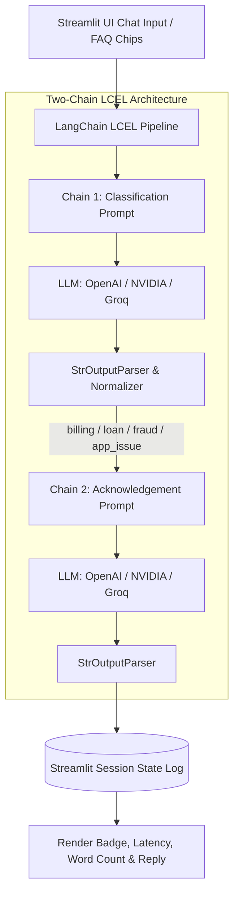

# Complaint Desk — LangChain Application (Activity 18.1)

A production-grade, two-chain LangChain (LCEL) and Streamlit application designed for automated financial customer complaint classification and empathetic acknowledgement generation, built for **Module 8: Hands-On Activity 18.1**.

Supports **OpenAI (`gpt-4o-mini`)**, **NVIDIA Hosted NIM (`meta/llama-3.2-11b-vision-instruct`)**, and **Groq (`llama-3.3-70b-versatile`)**.

---

## 1. Project Overview

**Complaint Desk** is an interactive web application built with Streamlit and LangChain (LCEL) that automates the initial triage and intake of customer grievances for a financial institution (*"XYZ Finance"*).

When a customer submits a complaint:
1. **Chain 1 (Classification)**: Classifies the grievance into one of four standardized categories (`billing`, `loan`, `fraud`, `app_issue`) using a zero-shot/few-shot classification chain.
2. **Chain 2 (Reply Generation)**: Generates a relevant, empathetic, and constrained ~60-word acknowledgement signed by *XYZ Finance Support*.
3. **Session Persistence**: Maintains full multi-turn conversation history and metrics across the session using Streamlit's native `st.session_state`.

---

## 2. System Architecture & Two-Chain Workflow



### Strict Architectural Scope (Module 8 Compliance):
- **Zero RAG / No Vector DBs**: Pure prompt engineering and few-shot exemplars as required by Module 8 before RAG is introduced in Module 9.
- **In-Memory Session Persistence**: Turn-by-turn context preserved in `st.session_state.log`.
- **Justified Temperature ($T=0.3$)**: Balancing deterministic category convergence with natural conversational phrasing.

---

## 3. Academic Rubric Mapping

| Rubric Dimension | Weight | Implementation Details |
|---|:---:|---|
| **Works End-to-End** | **40%** | Full interactive Streamlit app (`app.py`) executing Chain 1 $\rightarrow$ Category $\rightarrow$ Chain 2 $\rightarrow$ Response with multi-turn session persistence and category badge rendering. |
| **Prompt Quality & Temperature Choice** | **20%** | Engineered few-shot prompts with negative constraints (no PII collection, no hallucinated policies). Detailed justification for $T=0.3$ documented in app and README. |
| **Clean Repository & README** | **20%** | Clean structure, pinned `requirements.txt`, containerized `Dockerfile`, `.dockerignore`, `.gitignore`, and comprehensive evaluation suite. |
| **Live Deployed URL** | **20%** | Ready for 1-click deployment on **Streamlit Community Cloud** or containerized hosting on **AWS EC2 / Docker**. |

---

## 4. Temperature Choice Justification ($T=0.3$)

- **Deterministic Classification**: Low temperature minimizes entropy during token sampling, ensuring the model strictly adheres to the 4 target category tokens (`billing`, `loan`, `fraud`, `app_issue`) without generating conversational preamble.
- **Empathetic Variation**: Unlike $T=0.0$ (greedy search), $T=0.3$ allows subtle vocabulary variation for empathetic acknowledgement drafting without straying into hallucinated bank commitments.
- **Anti-Hallucination Guardrail**: Constrains the model from making up non-existent interest rates, fees, or premature resolution promises.

---

## 5. Local Setup & Quick Start

### 1. Clone & Navigate
```bash
git clone https://github.com/<your-username>/Complaint-Desk.git
cd Complaint-Desk/18.1_Complaint_Desk
```

### 2. Create Virtual Environment
```bash
# Windows
python -m venv venv
.\venv\Scripts\activate

# macOS / Linux
python3 -m venv venv
source venv/bin/activate
```

### 3. Install Dependencies
```bash
pip install -r requirements.txt
```

### 4. Set Environment Variables
Create a `.env` file or `.streamlit/secrets.toml`:
```env
OPENAI_API_KEY="your-openai-api-key"
# Or for NVIDIA NIM:
# NVIDIA_API_KEY="your-nvidia-api-key"
# Or for Groq:
# GROQ_API_KEY="your-groq-api-key"
```

### 5. Launch Application
```bash
streamlit run app.py
```
Open your browser at `http://localhost:8501`.

---

## 6. Docker & Container Deployment

### 1. Build Docker Image
```bash
docker build -t complaint-desk .
```

### 2. Run Container
```bash
docker run -d -p 8501:8501 \
  -e OPENAI_API_KEY="your-openai-api-key" \
  --name complaint-desk-app \
  complaint-desk
```
Access the application at `http://localhost:8501`.

---

## 7. Streamlit Community Cloud Deployment

1. Push this repository to your GitHub account.
2. Go to [share.streamlit.io](https://share.streamlit.io) and click **New App**.
3. Select your repository, set the branch to `main`, and main file path to `18.1_Complaint_Desk/app.py`.
4. Under **Advanced Settings > Secrets**, add your API key:
   ```toml
   OPENAI_API_KEY = "sk-..."
   ```
5. Click **Deploy**.

---

## 8. Evaluation Benchmark

Run the automated 24-case benchmark:
```bash
python evaluation/run_eval.py
```
Outputs classification accuracy %, turn latencies, and pass/fail status per test complaint.