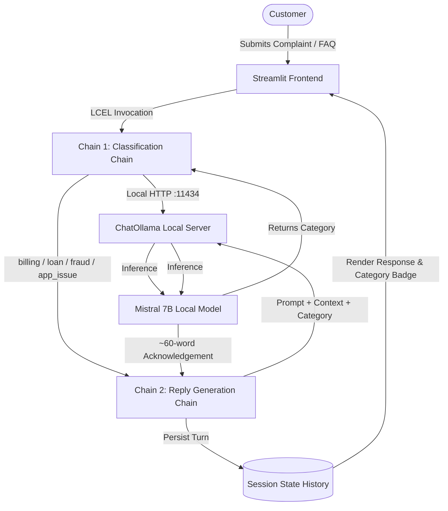

# Module 8 Activity 18.2 — The OpenAI ↔ Ollama Swap (Local Mistral)

This project implements **Module 8 Activity 18.2** (*"Activity B — the OpenAI ↔ Ollama Swap"*), swapping cloud-hosted LLM endpoints with a 100% local, privacy-first inference engine using **Ollama** and **Mistral**.

---

## 🏛️ Architecture Overview

The application retains the exact two-chain LangChain (LCEL) pipeline and user interface from Activity 18.1, swapping only the LLM backend in one line of code:



### The One-Line Swap:
```python
# Cloud-Hosted (Activity 18.1):
# llm = ChatOpenAI(model="gpt-4o-mini", temperature=0.3)

# Local On-Device (Activity 18.2):
llm = ChatOllama(model="mistral", temperature=0.3, base_url="http://localhost:11434")
```

### Key Differences from Activity 18.1:
| Dimension | Activity 18.1 (Cloud Hosted) | Activity 18.2 (Ollama Local Swap) |
|---|---|---|
| **Model** | `gpt-4o-mini` / `llama-3.2-11b` | `mistral` (7B) |
| **Provider** | Cloud API (OpenAI / NVIDIA NIM) | Local Ollama (`http://localhost:11434`) |
| **API Keys** | API Key required | **Zero API Keys required** |
| **Data Privacy** | Cloud inference via TLS | 100% local on-device (Zero data egress) |
| **Token Cost** | Metered per-token pricing | **$0.00 API Token Cost** |

---

## 🚀 Setup & Local Execution

### 1. Install Ollama
Download and install Ollama for your operating system:
- **Windows / macOS / Linux**: [https://ollama.com/download](https://ollama.com/download)
- Or on Windows via winget:
  ```powershell
  winget install Ollama.Ollama
  ```

### 2. Pull the Mistral Model
```bash
ollama pull mistral
```

### 3. Verify Ollama Installation
```bash
ollama list
```
You should see `mistral` listed with its size (~4.4 GB).

### 4. Ensure Ollama Server is Running
```bash
ollama serve
```
Verify the endpoint responds at [http://localhost:11434](http://localhost:11434) (displays `"Ollama is running"`).

### 5. Install Python Dependencies
```bash
cd 18.2_Ollama_Swap
pip install -r requirements.txt
```

### 6. Run the Streamlit Application
```bash
streamlit run app.py
```
The application will open at `http://localhost:8502` or `http://localhost:8501`.

---

## 🧪 Evaluation Benchmark

Run the automated benchmark on the 10 shared test complaints:
```bash
python evaluation/run_eval.py
```

The script:
1. Loads `evaluation/test_cases.csv` (10 standardized financial complaints).
2. Measures precise wall-clock latency per call.
3. Computes classification accuracy against the ground truth.
4. Reports cold-start vs. warm-state latency metrics.

Full comparative findings between 18.1 and 18.2 are documented in [`evaluation/evaluation_results.md`](./evaluation/evaluation_results.md).
