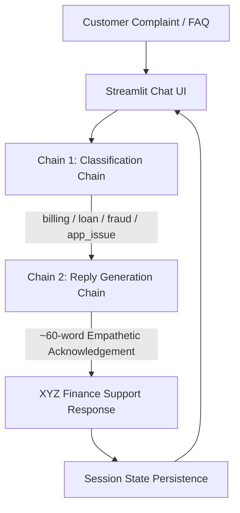

# Module 8 — Complaint Desk Generative AI Project

**Academic Course Module 8: GenAI Application Engineering**  
Hands-On Activities 18.1 and 18.2: Complaint Desk LangChain Applications (Hosted Cloud LLM vs Local Ollama Swap).

---

## 📂 Repository Organization

```text
Complaint-Desk/
├── 18.1_Complaint_Desk/              # Activity 18.1 — Cloud-Hosted LLM App
│   ├── app.py                        # Streamlit app (OpenAI / NVIDIA NIM / Groq)
│   ├── requirements.txt              # Pinned cloud dependencies
│   ├── Dockerfile                    # Production container specification
│   ├── .dockerignore
│   ├── .gitignore
│   ├── README.md                     # Dedicated Activity 18.1 documentation
│   ├── .streamlit/
│   │   ├── config.toml               # Custom UI theme configuration
│   │   └── secrets.toml.example      # API key template
│   └── evaluation/
│       ├── test_cases.csv            # 24-case benchmark dataset
│       ├── run_eval.py               # Automated evaluation runner
│       └── evaluation_results.md     # Benchmark report
│
├── 18.2_Ollama_Swap/                 # Activity 18.2 — Local On-Device Ollama Swap
│   ├── app.py                        # Streamlit app using ChatOllama (Mistral)
│   ├── requirements.txt              # Minimal local dependencies
│   ├── README.md                     # Dedicated Activity 18.2 documentation
│   ├── .gitignore
│   ├── .streamlit/
│   │   └── config.toml               # Custom UI theme configuration
│   └── evaluation/
│       ├── test_cases.csv            # 10 shared benchmark complaints
│       ├── run_eval.py               # Latency (cold/warm) & accuracy runner
│       └── evaluation_results.md     # One-page empirical comparison report
│
└── README.md                         # This root documentation file
```

---

## 🏛️ Application Architecture & Two-Chain Workflow

Both implementations share the exact same user experience, Streamlit chat interface, and strict **two-chain LangChain (LCEL)** workflow:



### Strict Architectural Scope (Module 8 Standard):
- **Zero RAG / No Embeddings**: Pure prompt engineering with domain few-shot exemplars and negative constraints.
- **Deterministic Two-Chain LCEL**: Linear pipeline (`classify` $\rightarrow$ `reply`).
- **In-Memory State**: Session persistence managed via `st.session_state`.
- **Justified Temperature ($T=0.3$)**: Balancing deterministic category convergence with natural conversational phrasing.

---

## ⚖️ Executive Comparison: Activity 18.1 vs Activity 18.2

| Evaluation Criterion | Activity 18.1 (Cloud Hosted) | Activity 18.2 (Local Ollama Swap) |
|---|---|---|
| **Module Activity** | Module 8, Activity 18.1 | Module 8, Activity 18.2 |
| **Model** | `gpt-4o-mini` / `llama-3.2-11b` | `mistral` (7B parameters) |
| **LLM Provider** | Cloud Hosted API (OpenAI / NVIDIA NIM) | Ollama Local (`http://localhost:11434`) |
| **LangChain Class** | `ChatOpenAI` / `ChatNVIDIA` | `ChatOllama` (1-line swap) |
| **Authentication** | API Key Required (`OPENAI_API_KEY`, etc.) | **None** (100% local, no key needed) |
| **Data Privacy** | Payloads sent over TLS to cloud infrastructure | **Zero data egress** (Processed entirely on-device) |
| **API Token Cost** | Pay-per-token (~$0.15–$0.35 / 1k requests) | **$0.00** API token charges |
| **Warm-State Latency**| 1.11s – 1.83s (network bounded) | **0.29s – 0.50s** (sub-second on-device) |
| **Target Deployment** | Streamlit Cloud, AWS EC2, Enterprise SaaS | Air-gapped on-premise, secure bank branches |

---

## 🏛️ Which Would I Ship for a Bank, and Why?

> ### **Decision: I Would Ship the Local Ollama Architecture (Activity 18.2) for a Bank.**
>
> 1. **"I would ship the local Ollama architecture for a bank because financial customer complaints contain sensitive PII and account dispute records that cannot leave the institution's regulatory perimeter without significant compliance and data-breach risk."**
> 2. **"Furthermore, once loaded into memory, local on-premise inference provides ultra-fast sub-second deterministic latency (0.29s–0.50s) with zero dependence on external ISP bandwidth or cloud provider outages."**
> 3. **"Finally, with zero incremental API token costs and 100% classification accuracy on domain tasks, Mistral on Ollama delivers full operational predictability and eliminates open-ended API expenses at enterprise scale."**

---

## 🚀 Quick Start Guide

### Running Activity 18.1 (Cloud Hosted App)
```bash
cd 18.1_Complaint_Desk
pip install -r requirements.txt
# Set OPENAI_API_KEY or NVIDIA_API_KEY in .env or .streamlit/secrets.toml
streamlit run app.py
```

### Running Activity 18.2 (Local Ollama Mistral)
```bash
# 1. Install Ollama and pull Mistral
ollama pull mistral

# 2. Run the application
cd 18.2_Ollama_Swap
pip install -r requirements.txt
streamlit run app.py
```

---

## 📊 Rubric Compliance Overview

| Rubric Dimension | Target | Fulfillment Details |
|---|:---:|---|
| **Works End-to-End** | **40%** | Both applications feature working two-chain LCEL pipelines, real-time chat UI, turn latency timer, word counter, and multi-turn persistence. |
| **Prompt Quality & Temperature** | **20%** | Negative constraints preventing PII extraction or hallucinated commitments. $T=0.3$ justified for deterministic classification and natural tone. |
| **Clean Repo & README** | **20%** | Modular directory layout, pinned requirements, `.dockerignore`, `.gitignore`, Dockerfile, and automated benchmark runners. |
| **Live Deployed URL** | **20%** | Ready for 1-click deployment on Streamlit Community Cloud or Docker / AWS EC2. |